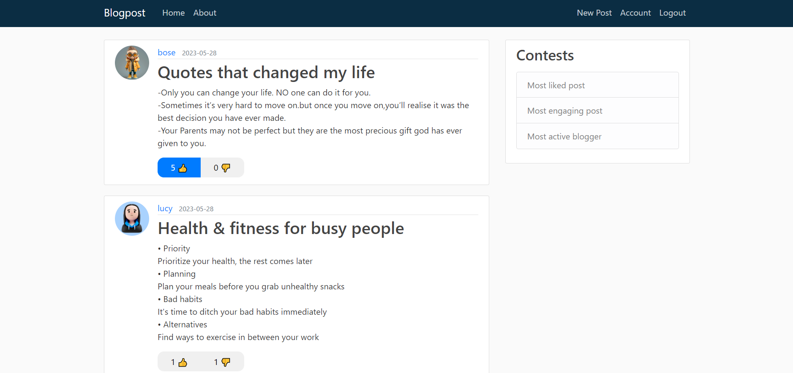
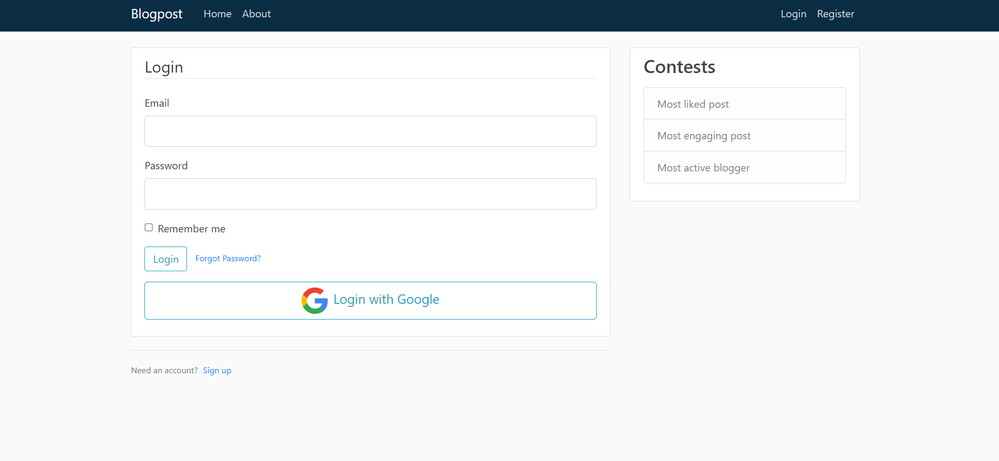
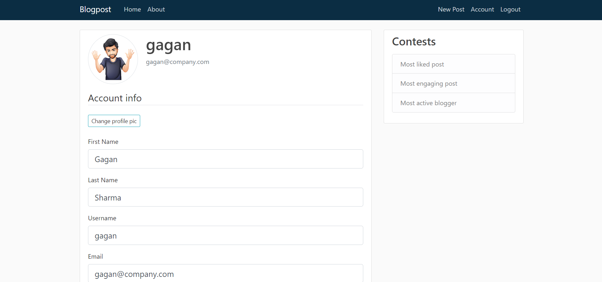
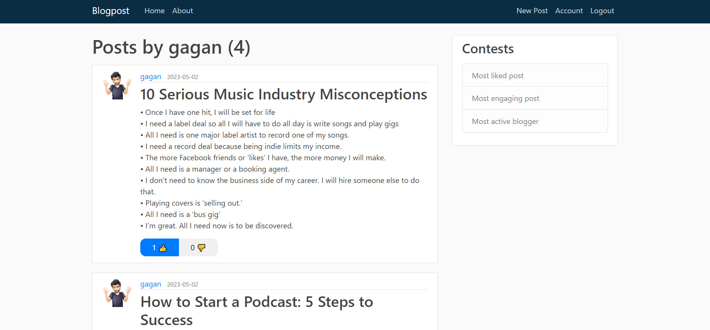

# Blogpost

This repository contains the source code and related files for Blogpost (a blogging website). Blogpost provides users with a platform to create, update and delete blog posts, as well as interact with posts from other users. It includes authentication features such as email login and Google login for a seamless user experience. Users also have the option to choose a custom profile picture to personalize their accounts.

## Features

Blogpost offers the following functionalities:

- **User authentication**: Users can create an account and log in using their email and password. Additionally, they have the option to log in using their Google account for convenience.
- **Custom profile picture**: Users can choose from existing options or upload a custom profile picture to personalize their accounts.
- **Create, update, and delete posts**: Authenticated users can create new blog posts, update the content of existing posts, and delete their own posts when necessary.
- **React to posts**: Users can react to posts from any user, expressing their feelings and opinions through likes or dislikes.
- **User-friendly interface**: The website utilizes the Bootstrap library, providing a responsive and visually appealing frontend design.
- **Secure Password Reset**: Never worry about forgetting your password. Easily reset your password by receiving a secure password reset link on your registered email.
- **Secure deployment**: The website is deployed using render.com, ensuring a secure and reliable hosting environment.

## Tools Used

Blogpost was developed using the following technologies and tools:

- Authentication:
  - Email-password login
  - Google login
- Backend:
  - Python
  - Flask (web framework)
- Frontend:
  - Bootstrap (CSS framework)
  - JavaScript
  - HTML
  - CSS
- Deployment:
  - render.com (platform for secure deployment)

## Website At a Glance

Homepage  

Login page  

Account Page  

User specific posts  

## Contributing

Contributions to Blogpost are welcome! If you have any suggestions, bug reports, or feature requests, please feel free to submit an issue or create a pull request in this repository.
